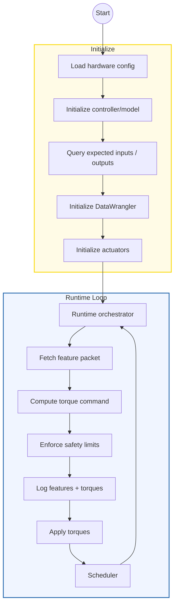
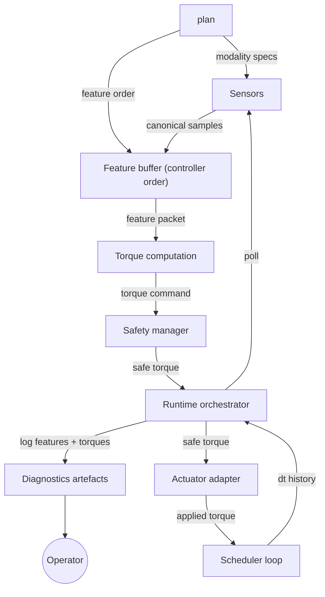
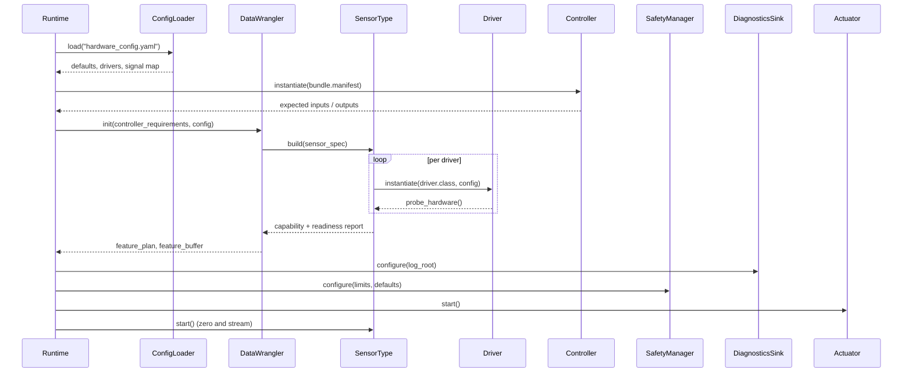
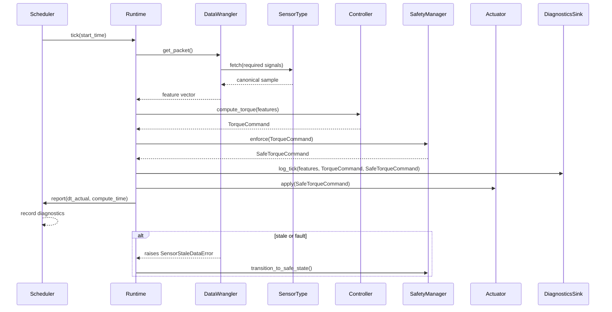
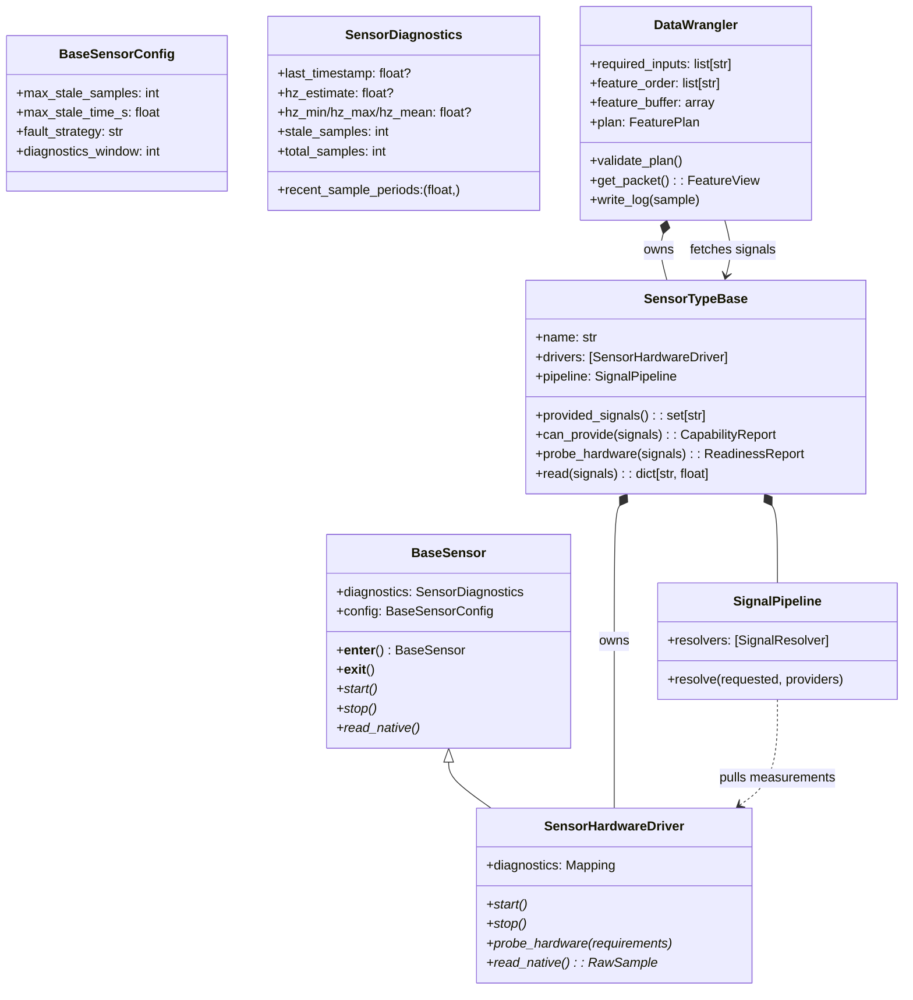
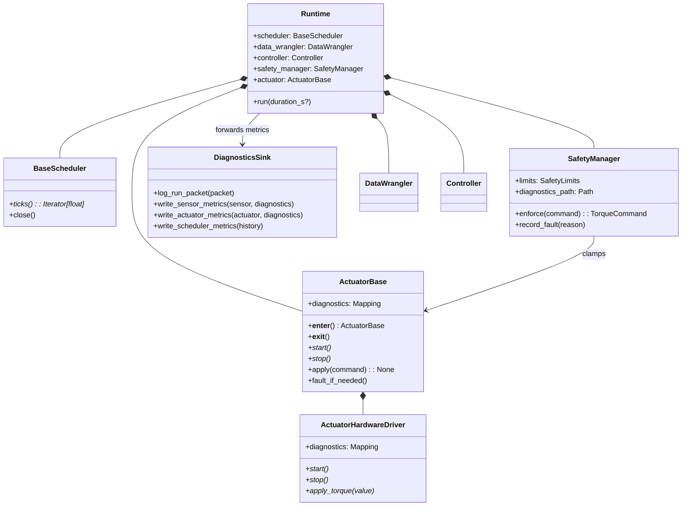

# Architecture Overview

This document specifies the controller runtime that will land alongside the new
profile-driven configuration pipeline. The goal is a simple yet flexible
architecture where sensors, actuators, and controllers can be swapped without
touching orchestration code.

- **Sensors** normalise hardware payloads into canonical signal names.
- **DataWrangler** plans how those signals are produced, owns feature buffers,
  and brokers reads between runtime and modalities.
- **Controllers** consume canonical features and emit torque commands while
  remaining agnostic to hardware specifics.
- **Safety + Actuators** enforce limits, surface diagnostics, and drive the
  physical interfaces.
- **Scheduler** governs cadence so the control loop can run deterministically on
  embedded Linux.

## Flow

### High-level loop



### Layered responsibilities

- **Configuration loader** parses the profile YAML, validates canonical signal
  names, and reads two lists — `input_signals` and `output_signals` — which
  define the fixed buffer ordering expected by the controller. This information
  seeds the DataWrangler plan.
- **DataWrangler plan** assigns each required input signal to a concrete sensor
  modality, computes derived feature dependencies, and allocates a reusable
  feature buffer following the configured `input_signals` order.
- **Runtime loop** repeatedly asks the DataWrangler for the next feature packet,
  computes torque commands, enforces safety limits, logs the features/torques,
  and issues actuator commands while the scheduler holds the desired loop period.
- **Diagnostics sink** receives run artefacts (merged logs, sensor timing,
  safety events) so field deployments can be audited after the fact.

### Input/Output signals

To keep operator edits minimal, the profile declares just two ordered lists. The
order of each list directly defines buffer indices for inputs and outputs:

```yaml
input_signals:  [knee_angle, knee_velocity, ankle_angle, ankle_velocity, grf_total]
output_signals: [knee_torque, ankle_torque]
```

Notes:
- These lists are canonical names only. No drivers, sensor types, defaults, or
  actuator targets appear here.
- Hardware mapping and any derived feature logic are internal to the runtime’s
  plan; operators only maintain the signal names and their order.

### End-to-end data flow



DataWrangler initialises once, so the runtime loop simply requests the next
packet each tick. Sensors emit canonical values; the wrangler places them into
the buffer following the controller-defined order, and derived feature resolvers
run using the same metadata that seeded the plan. The runtime orchestrator logs
each feature/torque snapshot before applying the safety-clamped command to the
actuator.

## Component Contracts

### DataWrangler interface

- `start(controller_manifest, config_path)` — performs all build-time work:
  parses configuration, validates canonical signals, resolves
  `sensor_types`/`measured_signals`/`derived_signals`, allocates the reusable
  feature buffer (aligned to the controller-requested order), opens sensor
  contexts, primes diagnostics, and returns a readiness report. Any validation
  or probe failure raises `HardwareAvailabilityError`.
- `get_packet()` — populates the buffer for the latest tick and returns a
  read-only view plus metadata (timestamps, staleness flags, defaults used).
  Raises `SensorStaleDataError` when thresholds are exceeded (honouring the
  configured `fault_strategy`) and bubbles `HardwareAvailabilityError` for
  modality failures.
- `close()` — tears down sensor contexts and flushes modality diagnostics.

Plan construction, buffer allocation, and other helpers remain internal to
`start()`; the wrangler is single-threaded and must not mutate plan metadata
once the loop begins so `get_packet()` can operate lock-free.

### Controller contract

- Controllers consume a fixed-order feature buffer whose indices are defined by
  the `input_signals` list. Outputs are produced in the order defined by the
  `output_signals` list. The controller may validate this order at start, but
  does not need to expose its own lists when the profile provides them.
- Controllers receive a `FeatureView` (mapping-like object) from the wrangler
  and must not mutate it.
- Controllers propagate `ControllerFault` exceptions when they cannot produce a
  torque command (e.g., model runtime error). The runtime catches these and
  transitions into a degraded or fault state depending on `fault_strategy`.

### Feature buffer ownership

- Allocated once, reused every tick; the runtime may retain a pointer for
  diagnostics, but only the wrangler writes into it.
- Buffer indices are stable across the session; derived feature resolvers write
  directly to their assigned slots.
- Each tick, the wrangler records presence/absence of optional channels so the
  diagnostics sink can report coverage (e.g., missing GRF sensor).

### Diagnostics sink contract

- The runtime depends on an injectable `DiagnosticsSink` responsible solely for
  runtime-level logging (feature packets, raw torques, safety-adjusted torques,
  scheduler metrics).
- Core interface:
  - `log_tick(*, timestamp, feature_packet, torque_command_raw, torque_command_safe, scheduler)` —
    invoked once per tick after the safety manager clamps outputs and before the
    actuator runs. Diagnostics errors must never break the control loop; sinks
    swallow/report internally.
  - `flush()` — called during teardown to ensure any buffered artefacts reach
    persistent storage.
- The sink does not duplicate per-sensor or per-actuator diagnostics; those stay
  with modality-specific loggers.
- Implementations must be non-blocking: heavy IO should occur via buffered
  appends or background workers so scheduler cadence remains stable.

## Safety and runtime states

The runtime behaves as a small state machine:

1. **Initialising** — building the plan, probing hardware, zeroing sensors.
   Failure exits to **Faulted**.
2. **Calibration** — optional phase where `CalibrationRoutine` runs. Failure
   either retries (bounded by `calibration.max_attempts`) or transitions to
   **Degraded** with defaults.
3. **Running** — controller torque computations succeed, scheduler cadence remains within tolerance.
4. **Degraded** — non-critical sensor or actuator faults occur. Runtime keeps
   looping but clamps torques to safe defaults and emits warnings; if the
   failing component recovers before `recovery_timeout_s`, state returns to
   **Running**.
5. **Faulted** — critical failure (e.g., controller exception, actuator write
   failure) or operator stop. Actuator receives `zero_torque` command before the
   loop exits. Diagnostics flush state machine transitions for post-mortem
   analysis.

The SafetyManager enforces torque limits per joint and records clamp events. It
also exposes a `transition_to_safe_state()` hook for the runtime to invoke when
entering **Faulted** so downstream hardware can coast safely.

## Timing and concurrency

- Wranglers and controllers run in the scheduler thread; sensor reads are
  blocking but expected to complete within `max_sensor_read_s` (configured per
  modality). Long-running sensors must provide non-blocking implementations or
  move heavy work into their drivers with caching.
- The scheduler governs cadence using monotonic time. It records:
  - `dt_target`, `dt_actual`, and the cumulative jitter metrics.
  - Controller compute duration (`compute_time_s`).
- If a tick overruns (`dt_actual > dt_target + jitter_budget`), the runtime logs
  a timing warning. After `max_overruns_before_fault` consecutive overruns, the
  runtime transitions to **Degraded**.
- Actuator commands are applied synchronously. If the actuator queue is
  asynchronous, the adapter must guarantee ordering and provide a completion
  callback for diagnostics.

## Diagnostics format

- **Run log** (`run.log`): newline-delimited JSON. Each entry contains
  `{timestamp, feature_packet, torque_command_raw, torque_command_safe, safety_events, scheduler}`.
- **Sensors**: one file per sensor under `diagnostics/sensors/<name>.jsonl`
  capturing `{timestamp, hz_estimate, stale_samples, defaults_applied}` and any
  driver-specific metrics.
- **Actuators**: `diagnostics/actuators/<name>.jsonl` with clamp counts,
  commanded torques, and hardware faults.
- **Scheduler**: `diagnostics/scheduler/loop_metrics.jsonl` summarising dt
  history, compute durations, and overrun flags.
- **Safety**: `diagnostics/safety/events.jsonl` listing clamp actions, limit
  strategy results, and state transitions.

All artefacts share a common schema version stamped in the header so downstream
tools can evolve alongside the runtime.

## Failure and retry policy

- **Sensor stale data**: Respect per-sensor `fault_strategy`.
  - `raise`: bubble `SensorStaleDataError`, runtime enters **Faulted**.
  - `warn`: log, substitute defaults, remain in current state.
  - `fallback`: switch to synthetic sample (held last good value or zero) and
    enter **Degraded** until fresh data returns.
- **Derived signal failure**: if a resolver cannot compute a signal (missing
  dependency), treat as sensor stale. Derived failures are attributed to the
  originating modality for diagnostics.
- **Controller exceptions**: transition to **Faulted**, zero actuator, flush
  logs, and rethrow unless `controller.retry_on_failure` is enabled (bounded
  retries with exponential backoff).
- **Actuator errors**: first failure triggers **Degraded**; actuators must
  report `recoverable` vs `fatal`. Fatal errors move to **Faulted** immediately.
- **Configuration mismatches**: detected during `build_plan()` and abort before
  initialisation.

## Sequence

### Startup handshake



**Validation guarantees**

- Every required controller channel must have at least one compatible provider.
- Optional channels may be satisfied by hardware or by defaults declared in the
  profile.
- Derived signals express their dependencies explicitly, so the plan fails early
  if prerequisites are unavailable.
- Probe failures bubble back up before the runtime loop starts, allowing the
  operator to replace hardware or switch to a degraded profile.

### Control loop cadence



The runtime records per-tick timing, the full feature packet, and torque
commands both before and after safety enforcement. Actuators are allowed to
raise hardware faults after a command is applied; the runtime catches them and
decides whether to stop the loop or continue in a degraded mode depending on the
profile fault strategy.

## UML

### Sensor and DataWrangler contracts



### Runtime, safety, and actuation



The UML diagrams serve as contracts for upcoming implementations. Any new
modalities or actuators must implement the abstract methods listed above and
report diagnostics in the documented format.

## Configuration Schema

### `hardware_config.yaml` layout

All runtime wiring lives in a single YAML document. The loader validates the
following top-level keys:

| Key | Required | Purpose |
|-----|----------|---------|
| `defaults` | optional | Global configuration such as numeric dtype, fault strategy, and diagnostic paths. |
| `drivers` | required | Mapping of driver identifiers to import paths and keyword arguments. |
| `sensor_types` | required | Logical sensors (e.g., `imu`, `vertical_grf`) composed from one or more drivers with derived signal rules. |
| `measured_signals` | required | Canonical signal → provider mapping that resolves controller inputs against sensor types. |
| `derived_signals` | optional | Additional canonical signals computed from prerequisites; evaluated by the DataWrangler pipeline. |
| `controllers` | required | Controller bundles that declare input/output schemas, torque model implementations, and configuration. |
| `actuators` | required | Actuator adapters and their bindings to controller outputs. |
| `safety` | optional | Limit definitions (per joint torque caps, fault strategies, watchdog timeouts). |
| `diagnostics` | optional | Paths or sinks for runtime artefacts (log roots, retention windows). |

The DataWrangler consumes `sensor_types`, `measured_signals`, and
`derived_signals` to build its feature plan. Controllers reference canonical
signal names exposed in `measured_signals` (and possibly defaults); actuators
declare which canonical torques they accept.

### Example configuration

```yaml
defaults:
  dtype: float32
  fault_strategy: raise
  feature_order: ["hip_angle", "hip_velocity", "knee_angle", "knee_velocity"]
  log_root: /var/log/rpc_runtime

drivers:
  imu_microstrain:
    class: rpc_runtime.sensors.imu.microstrain_3dm_gx5.Microstrain3DMGX5IMU
    config:
      port_map:
        thigh: /dev/ttyIMU_thigh
        shank: /dev/ttyIMU_shank
      max_stale_samples: 3
  fsr_bluetooth:
    class: rpc_runtime.sensors.grf.fsr.BluetoothFSR
    config:
      address: E8:EA:71:E8:37:D1

sensor_types:
  imu:
    drivers: ["imu_microstrain"]
    provides:
      measured: ["thigh_angle", "thigh_velocity", "shank_angle", "shank_velocity"]
      derived:
        knee_angle:
          requires: ["thigh_angle", "shank_angle"]
          resolver: rpc_runtime.sensors.resolvers.JointDifference
  vertical_grf:
    drivers: ["fsr_bluetooth"]
    provides:
      measured: ["grf_total"]

measured_signals:
  hip_angle: { provider: imu, alias: thigh_angle }
  hip_velocity: { provider: imu, alias: thigh_velocity }
  knee_angle: { provider: imu }
  knee_velocity: { provider: imu, alias: shank_velocity }
  grf_total: { provider: vertical_grf, required: false, default: 0.0 }

controllers:
  pi_right_leg:
    implementation: rpc_runtime.controllers.pi_controller.PIController
    input_schema: ["hip_angle", "hip_velocity", "knee_angle", "knee_velocity", "grf_total"]
    output_schema: ["hip_torque", "knee_torque"]
    torque_model:
      implementation: rpc_runtime.controllers.torque_models.torchscript.TorchScriptTorqueModel
      config:
        bundle_path: /opt/models/right_leg.ts
    config:
      dt: 0.002
      torque_scale: 1.0
      torque_limit_nm: 60.0
      velocity_filter_alpha: 0.1
      torque_filter_alpha: 0.05
      gains:
        kp: { hip: 14.0, knee: 18.0 }
        ki: { hip: 1.0, knee: 1.2 }

actuators:
  osl_leg:
    driver: rpc_runtime.actuators.osl_actuator.OSLActuator
    config:
      device: /dev/ttyACM0
    accepts:
      hip_torque: hip
      knee_torque: knee

safety:
  limits:
    hip:
      max_torque_nm: 70.0
      clamp_strategy: saturate
    knee:
      max_torque_nm: 80.0
      clamp_strategy: saturate
  watchdog:
    max_tick_hz_delta: 0.0005

diagnostics:
  sinks:
    - type: filesystem
      path: /var/log/rpc_runtime
      history: 14d
```

### Canonical signals and derived features

- Canonical names are registered centrally so controllers and hardware share the
  same vocabulary (`hip_angle`, `grf_total`, `knee_torque`, etc.).
- `measured_signals` entries may alias raw sensor outputs when the canonical
  name differs from the hardware-provided label.
- Each `derived` resolver declares `requires` so the DataWrangler can ensure all
  prerequisites are available before runtime.
- Defaults cover optional signals: if hardware is missing, the DataWrangler
  drops the measurement and populates the feature buffer with the configured
  fallback value.

### Calibration, diagnostics, and artefacts

- Calibration routines run immediately after sensors start while the runtime is
  in the **Calibration** state. Sensors that expose `zero()` opt into the hook;
  retry counts and failure handling are governed by `calibration.*` defaults.
- Diagnostics write into `diagnostics/<category>/` under the configured log
  root using newline-delimited JSON (`*.jsonl`). Categories mirror the
  Diagnostics format section above so tooling can rely on consistent schema
  versions.
- Each runtime session emits a `run.log` file (also JSONL) containing
  time-aligned feature packets, commanded torques, scheduler jitter, and
  safety-state transitions.

### Extensibility checklist

To add a new modality or actuator:

1. Implement the abstract methods shown in the UML diagrams and honour the
   component contracts described above.
2. Register any new canonical signals with documentation and defaults.
3. Add driver entries under `drivers` and expose them through `sensor_types`,
   including capability probes and diagnostics exports.
4. Declare derived signal resolvers if the modality synthesises new channels and
   document their failure behaviour.
5. Extend `hardware_config.yaml` to map controller schema channels to the new
   providers and update `FeaturePlan` validation tests.
6. Provide calibration hooks or defaults so the **Calibration** state can
   execute cleanly.
7. Emit diagnostics in the documented JSONL format and bump schema versions when
   fields change.
8. Update the failure policy documentation or defaults if the new component
   introduces non-standard retry logic.

With those pieces in place, the RuntimeLoop can swap components by loading a
different profile without requiring code changes.
