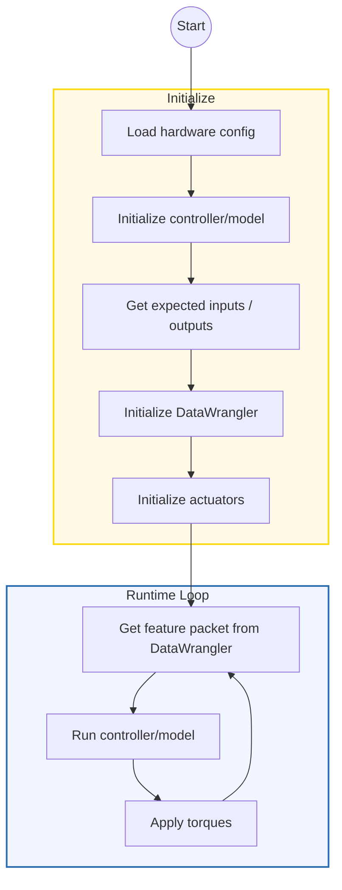
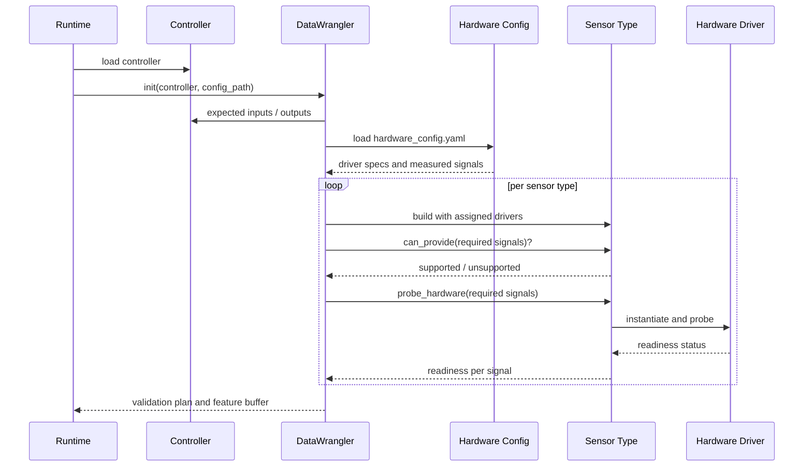
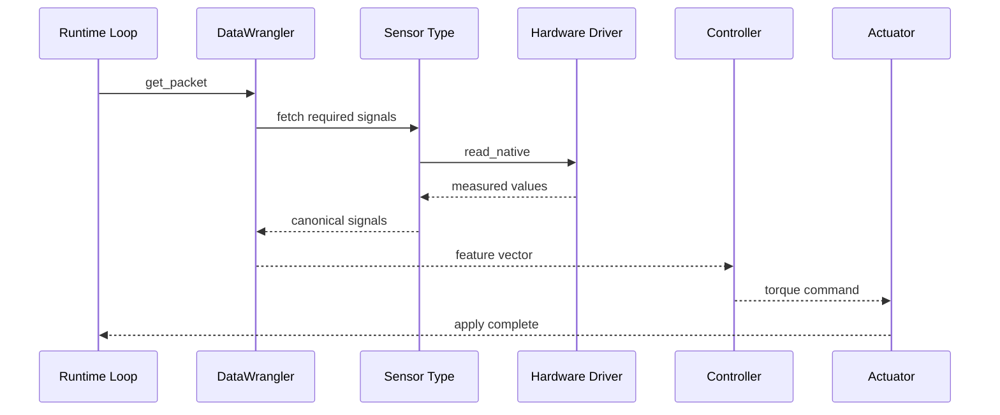
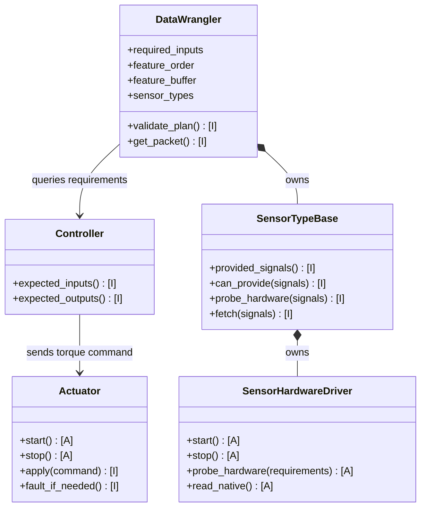
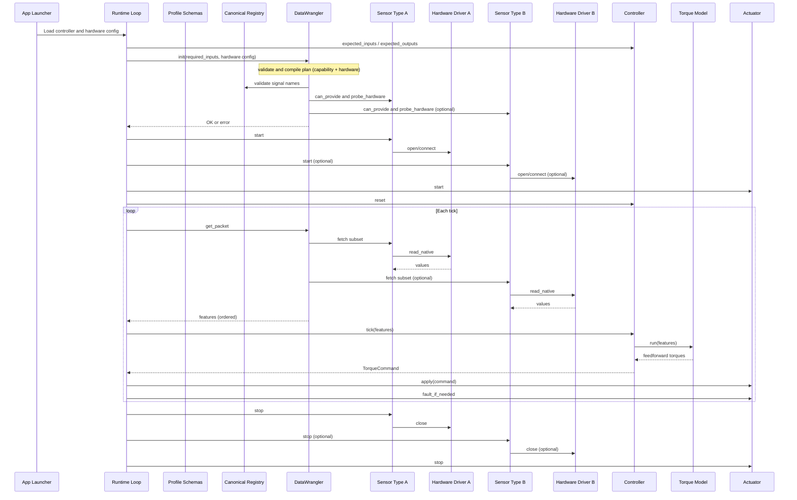
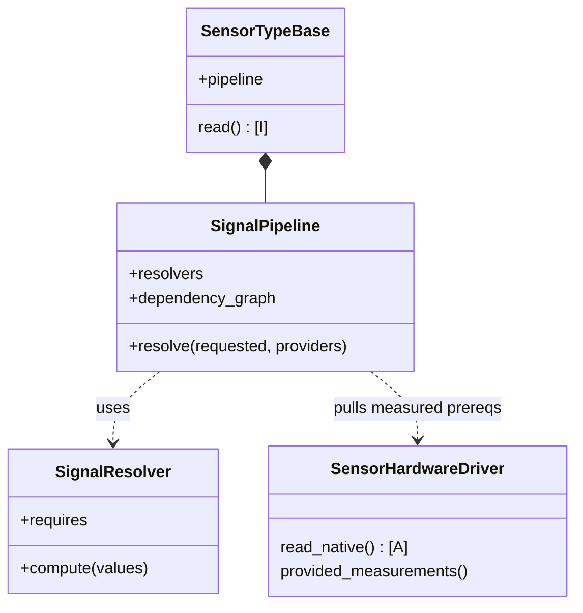
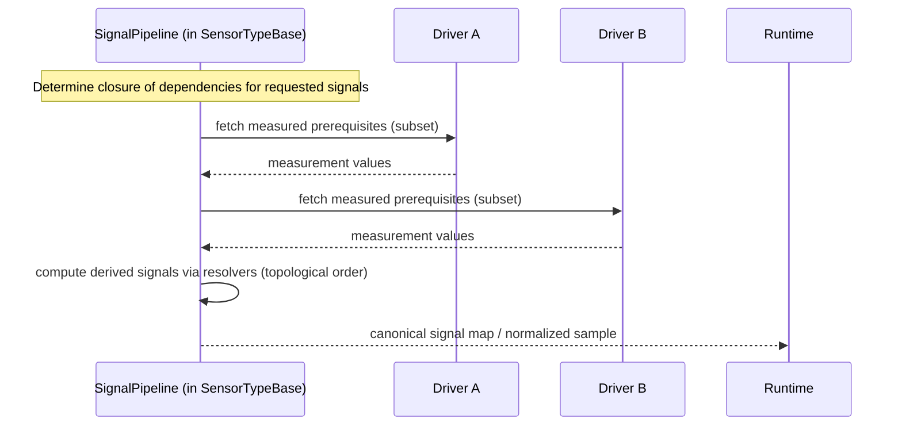

# Architecture Overview

The runtime splits responsibilities into four layers:

1. **Sensors** — `rpc_runtime.sensors` exposes hardware‑agnostic modality bases (e.g., IMU/GRF) and hardware drivers. Adapters translate vendor payloads into standardized samples; modality bases aggregate multiple drivers and compute canonical signals.
2. **Controllers** — `rpc_runtime.controllers` implements the PI controller skeleton with replaceable torque models (`onnxruntime`, `torchscript`). Controllers declare required input/output signals.
3. **Actuators** — `rpc_runtime.actuators` provides safe torque application and fault reporting. Adapters validate joint membership and enforce optional torque limits.
4. **Pipelines** — `rpc_runtime.pipelines.RuntimeLoop` orchestrates the read→compute→actuate loop; `rpc_runtime.pipelines.scheduler` abstracts timing. A lightweight DataWrangler compiles requested signals into a model‑ready feature packet.

Configuration lives in a single `hardware_config.yaml`. Controllers declare the
canonical signals they consume and produce; the hardware config maps measured
signals to concrete drivers and establishes defaults. Derived signals are
computed in code by the modality pipeline (no config fields required).

Example `hardware_config.yaml`:

```yaml
defaults:
  dtype: float32
  fault_strategy: raise
  include_mask: false

drivers:
  thigh_imu:
    class: rpc_runtime.sensors.imu.microstrain_3dm_gx5.Microstrain3DMGX5IMU
    config:
      port_map:
        thigh: /dev/ttyIMU_thigh
      max_stale_samples: 3
  shank_imu:
    class: rpc_runtime.sensors.imu.mock.MockIMU
    config:
      loop: true
  fsr:
    class: rpc_runtime.sensors.grf.fsr.BluetoothFSR
    config:
      address: E8:EA:71:E8:37:D1

measured_signals:
  thigh_angle: thigh_imu
  thigh_rate: thigh_imu
  shank_angle: shank_imu
  shank_rate: shank_imu
  grf_total: fsr
```

Startup:
- Controller exposes `expected_inputs` and `expected_outputs` (ordered).
- Load `hardware_config.yaml`; instantiate drivers; build one SensorType per modality/scope.
- DataWrangler validates capability and hardware, compiles a plan, and allocates
  a reusable feature buffer (dtype from defaults).
- Runtime loop calls `wrangler.get_packet` each tick and forwards the feature
  vector to the controller; torques route to actuators via the runtime loop.

## High‑level flow



DataWrangler performs configuration validation and planning once at
initialisation, so the runtime loop only asks it for feature packets each tick.

### DataWrangler initialisation sequence



### DataWrangler runtime sequence



### DataWrangler relationships



## Control loop sequence



<!-- Legacy interface overview removed in favor of DataWrangler-centric diagrams. -->

## Measured vs. derived signals

Some canonical signals are measured directly by drivers (e.g., segment angles);
others are derived by the sensor type from prerequisites (e.g., joint angle
derived as the difference of two segment angles). The sensor type uses a small
SignalPipeline to compute derived values across one or more drivers.



### Per‑tick resolution flow


