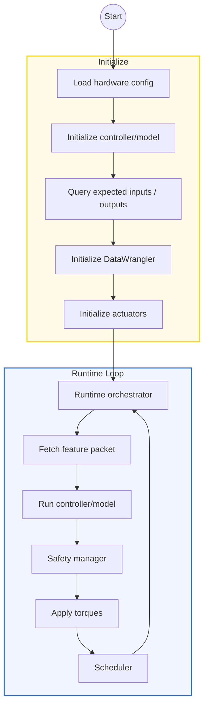
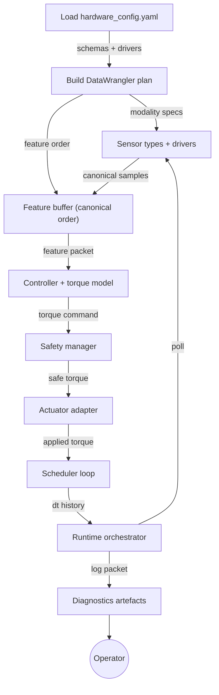
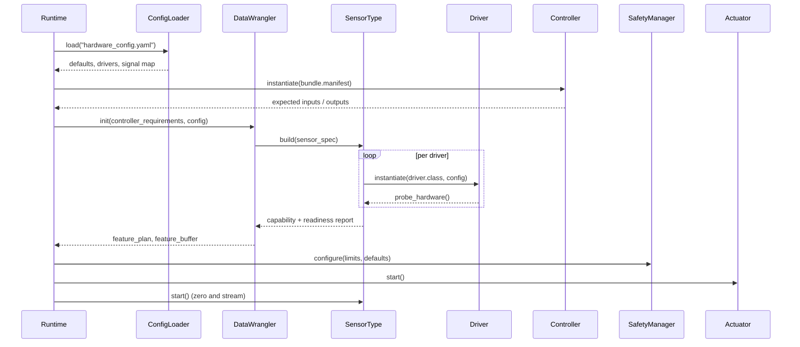
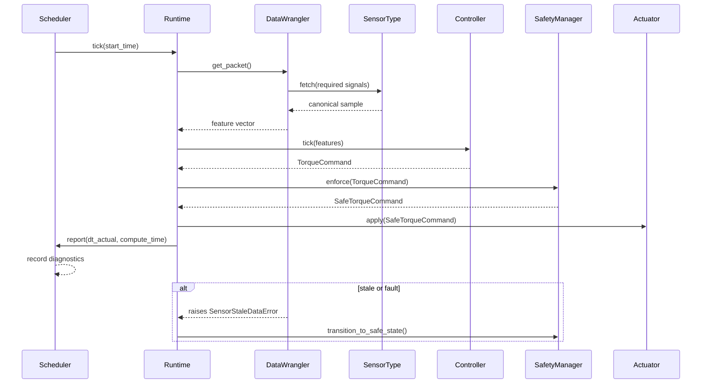
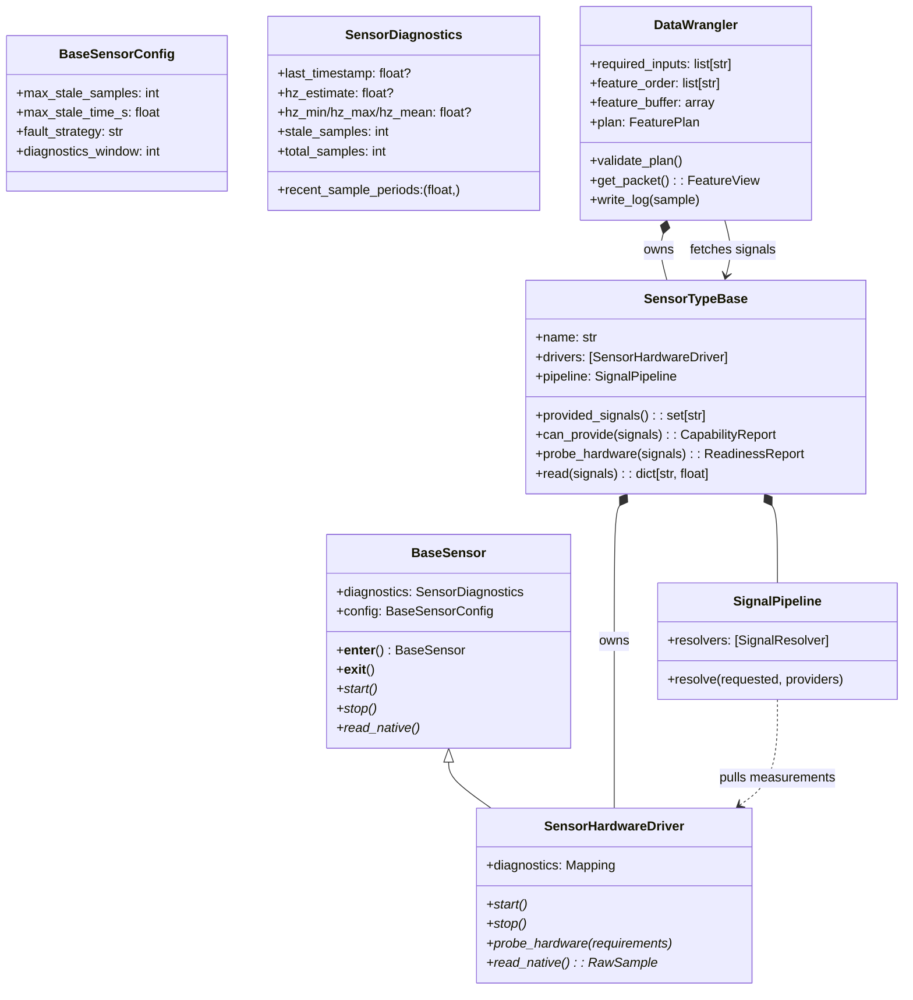
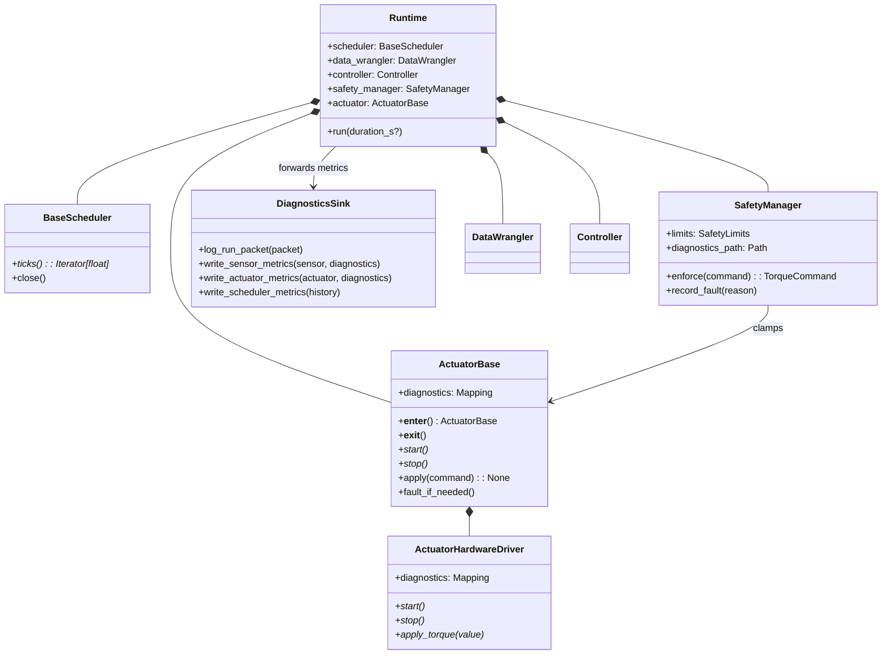

# Architecture Overview

This document specifies the controller runtime that will land alongside the new
profile-driven configuration pipeline. The goal is a simple yet flexible
architecture where sensors, actuators, and controllers can be swapped without
touching orchestration code.

- **Sensors** normalise hardware payloads into canonical signal names.
- **DataWrangler** plans how those signals are produced, owns feature buffers,
  and brokers reads between runtime and modalities.
- **Controllers** consume canonical features and emit torque commands while
  remaining agnostic to hardware specifics.
- **Safety + Actuators** enforce limits, surface diagnostics, and drive the
  physical interfaces.
- **Scheduler** governs cadence so the control loop can run deterministically on
  embedded Linux.

## Flow

### High-level loop



### Layered responsibilities

- **Configuration loader** parses `hardware_config.yaml`, validates canonical
  signal names, and hands the DataWrangler enough metadata to build a plan.
- **DataWrangler plan** assigns each required signal to a concrete sensor type,
  computes derived feature dependencies, and allocates a reusable feature buffer
  with deterministic ordering.
- **Runtime loop** repeatedly asks the DataWrangler for the next feature packet,
  ticks the controller, enforces safety, and issues actuator commands while the
  scheduler holds the desired loop period.
- **Diagnostics sink** receives run artefacts (merged logs, sensor timing,
  safety events) so field deployments can be audited after the fact.

### End-to-end data flow



DataWrangler initialises once, so the runtime loop simply requests the next
packet each tick. Sensors must return canonical values in the agreed order, and
derived feature resolvers run using the same metadata that seeded the plan.

## Sequence

### Startup handshake



**Validation guarantees**

- Every required controller channel must have at least one compatible provider.
- Optional channels may be satisfied by hardware or by defaults declared in the
  profile.
- Derived signals express their dependencies explicitly, so the plan fails early
  if prerequisites are unavailable.
- Probe failures bubble back up before the runtime loop starts, allowing the
  operator to replace hardware or switch to a degraded profile.

### Control loop cadence



The runtime records per-tick timing and safety events. Actuators are allowed to
raise hardware faults after a command is applied; the runtime catches them and
decides whether to stop the loop or continue in a degraded mode depending on the
profile fault strategy.

## UML

### Sensor and DataWrangler contracts



### Runtime, safety, and actuation



The UML diagrams serve as contracts for upcoming implementations. Any new
modalities or actuators must implement the abstract methods listed above and
report diagnostics in the documented format.

## Configuration Schema

### `hardware_config.yaml` layout

All runtime wiring lives in a single YAML document. The loader validates the
following top-level keys:

| Key | Required | Purpose |
|-----|----------|---------|
| `defaults` | optional | Global configuration such as numeric dtype, fault strategy, and diagnostic paths. |
| `drivers` | required | Mapping of driver identifiers to import paths and keyword arguments. |
| `sensor_types` | required | Logical sensors (e.g., `imu`, `vertical_grf`) composed from one or more drivers with derived signal rules. |
| `measured_signals` | required | Canonical signal → provider mapping that resolves controller inputs against sensor types. |
| `derived_signals` | optional | Additional canonical signals computed from prerequisites; evaluated by the DataWrangler pipeline. |
| `controllers` | required | Controller bundles that declare input/output schemas, torque model implementations, and configuration. |
| `actuators` | required | Actuator adapters and their bindings to controller outputs. |
| `safety` | optional | Limit definitions (per joint torque caps, fault strategies, watchdog timeouts). |
| `diagnostics` | optional | Paths or sinks for runtime artefacts (log roots, retention windows). |

The DataWrangler consumes `sensor_types`, `measured_signals`, and
`derived_signals` to build its feature plan. Controllers reference canonical
signal names exposed in `measured_signals` (and possibly defaults); actuators
declare which canonical torques they accept.

### Example configuration

```yaml
defaults:
  dtype: float32
  fault_strategy: raise
  feature_order: ["hip_angle", "hip_velocity", "knee_angle", "knee_velocity"]
  log_root: /var/log/rpc_runtime

drivers:
  imu_microstrain:
    class: rpc_runtime.sensors.imu.microstrain_3dm_gx5.Microstrain3DMGX5IMU
    config:
      port_map:
        thigh: /dev/ttyIMU_thigh
        shank: /dev/ttyIMU_shank
      max_stale_samples: 3
  fsr_bluetooth:
    class: rpc_runtime.sensors.grf.fsr.BluetoothFSR
    config:
      address: E8:EA:71:E8:37:D1

sensor_types:
  imu:
    drivers: ["imu_microstrain"]
    provides:
      measured: ["thigh_angle", "thigh_velocity", "shank_angle", "shank_velocity"]
      derived:
        knee_angle:
          requires: ["thigh_angle", "shank_angle"]
          resolver: rpc_runtime.sensors.resolvers.JointDifference
  vertical_grf:
    drivers: ["fsr_bluetooth"]
    provides:
      measured: ["grf_total"]

measured_signals:
  hip_angle: { provider: imu, alias: thigh_angle }
  hip_velocity: { provider: imu, alias: thigh_velocity }
  knee_angle: { provider: imu }
  knee_velocity: { provider: imu, alias: shank_velocity }
  grf_total: { provider: vertical_grf, required: false, default: 0.0 }

controllers:
  pi_right_leg:
    implementation: rpc_runtime.controllers.pi_controller.PIController
    input_schema: ["hip_angle", "hip_velocity", "knee_angle", "knee_velocity", "grf_total"]
    output_schema: ["hip_torque", "knee_torque"]
    torque_model:
      implementation: rpc_runtime.controllers.torque_models.torchscript.TorchScriptTorqueModel
      config:
        bundle_path: /opt/models/right_leg.ts
    config:
      dt: 0.002
      torque_scale: 1.0
      torque_limit_nm: 60.0
      velocity_filter_alpha: 0.1
      torque_filter_alpha: 0.05
      gains:
        kp: { hip: 14.0, knee: 18.0 }
        ki: { hip: 1.0, knee: 1.2 }

actuators:
  osl_leg:
    driver: rpc_runtime.actuators.osl_actuator.OSLActuator
    config:
      device: /dev/ttyACM0
    accepts:
      hip_torque: hip
      knee_torque: knee

safety:
  limits:
    hip:
      max_torque_nm: 70.0
      clamp_strategy: saturate
    knee:
      max_torque_nm: 80.0
      clamp_strategy: saturate
  watchdog:
    max_tick_hz_delta: 0.0005

diagnostics:
  sinks:
    - type: filesystem
      path: /var/log/rpc_runtime
      history: 14d
```

### Canonical signals and derived features

- Canonical names are registered centrally so controllers and hardware share the
  same vocabulary (`hip_angle`, `grf_total`, `knee_torque`, etc.).
- `measured_signals` entries may alias raw sensor outputs when the canonical
  name differs from the hardware-provided label.
- Each `derived` resolver declares `requires` so the DataWrangler can ensure all
  prerequisites are available before runtime.
- Defaults cover optional signals: if hardware is missing, the DataWrangler
  drops the measurement and populates the feature buffer with the configured
  fallback value.

### Calibration, diagnostics, and artefacts

- Calibration routines run immediately after sensors start. Sensors that expose
  `zero()` opt into a pre-loop calibration hook.
- Diagnostics write into `diagnostics/<category>/` under the configured log
  root. Sensors record sampling statistics, actuators record faults and clamp
  counts, and the scheduler records dt history plus controller compute times.
- Each runtime session emits a `run.log` file containing time-aligned sensor
  packets, commanded torques, and safety events.

### Extensibility checklist

To add a new modality or actuator:

1. Implement the abstract methods shown in the UML diagrams.
2. Register any new canonical signals with documentation.
3. Add driver entries under `drivers` and expose them through `sensor_types`.
4. Declare derived signal resolvers if the modality synthesises new channels.
5. Extend `hardware_config.yaml` to map controller schema channels to the new
   providers.

With those pieces in place, the RuntimeLoop can swap components by loading a
different profile without requiring code changes.
