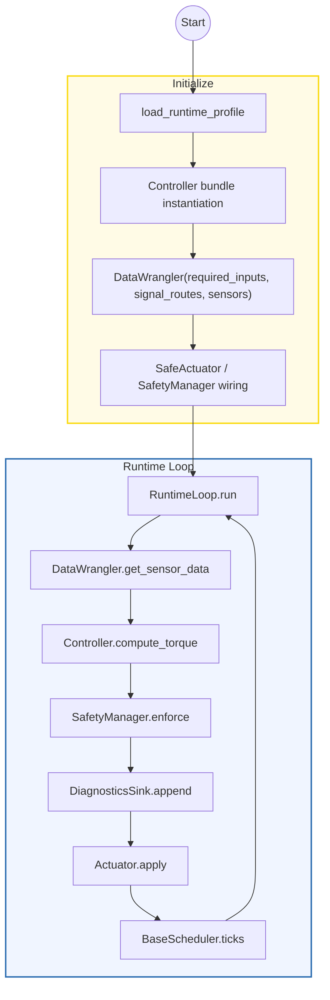
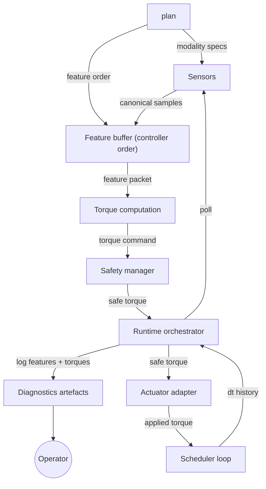
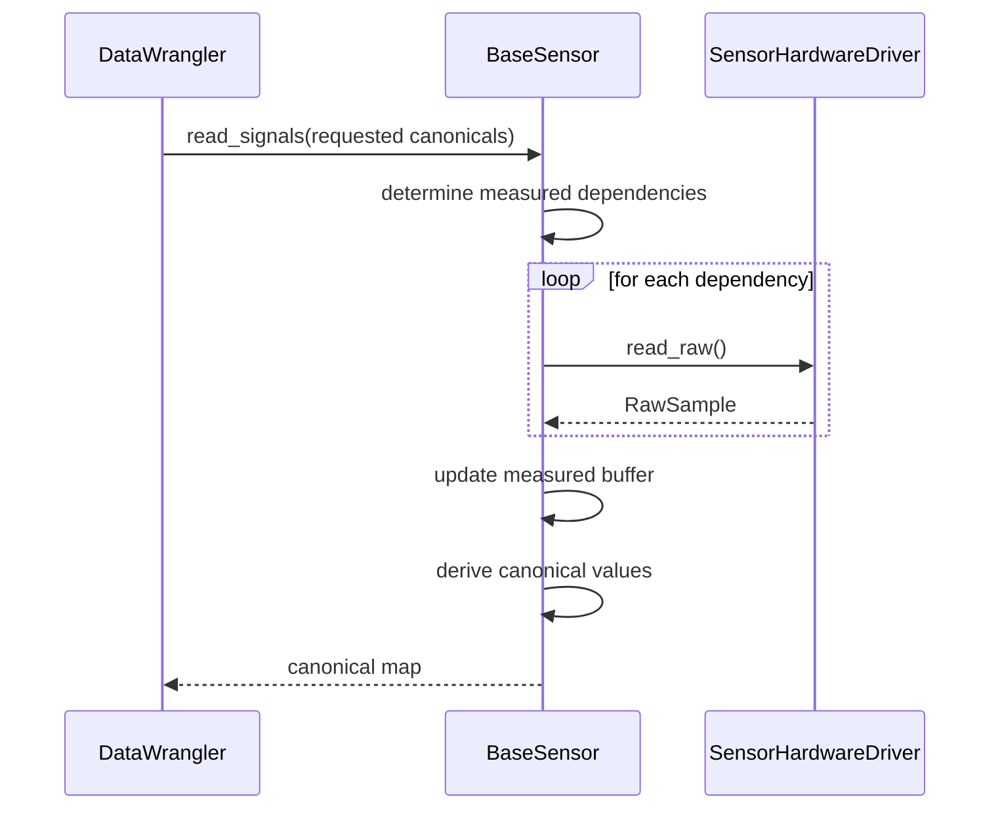
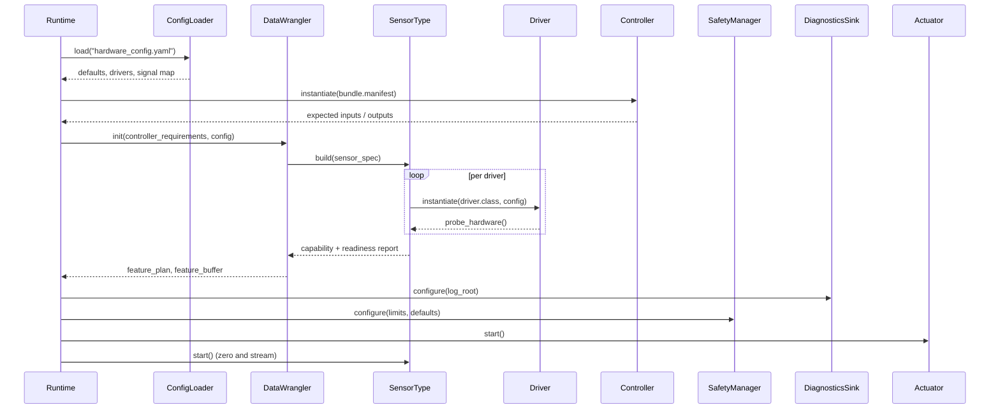
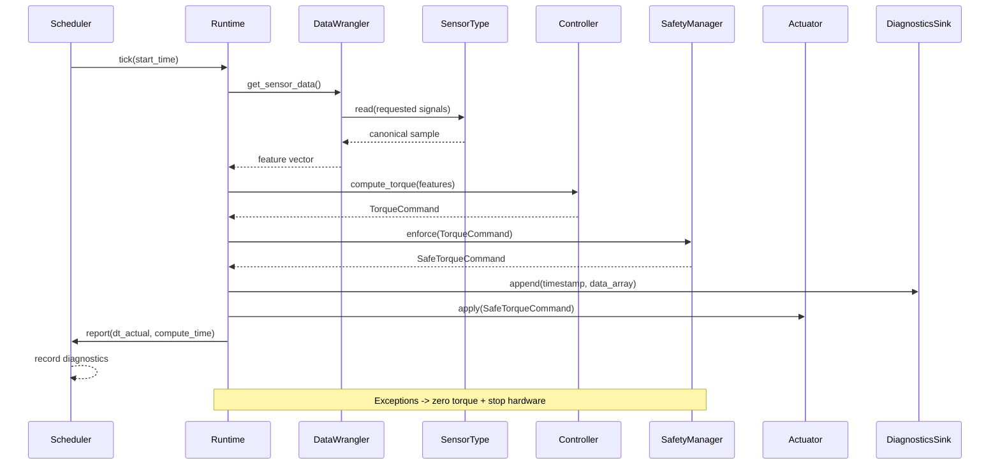
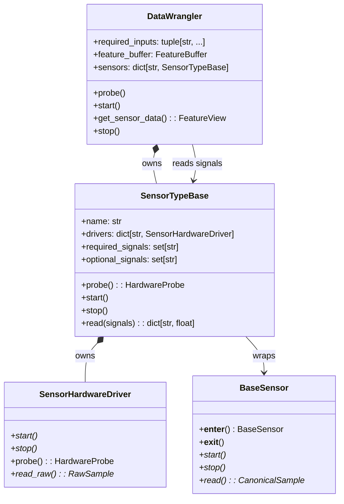
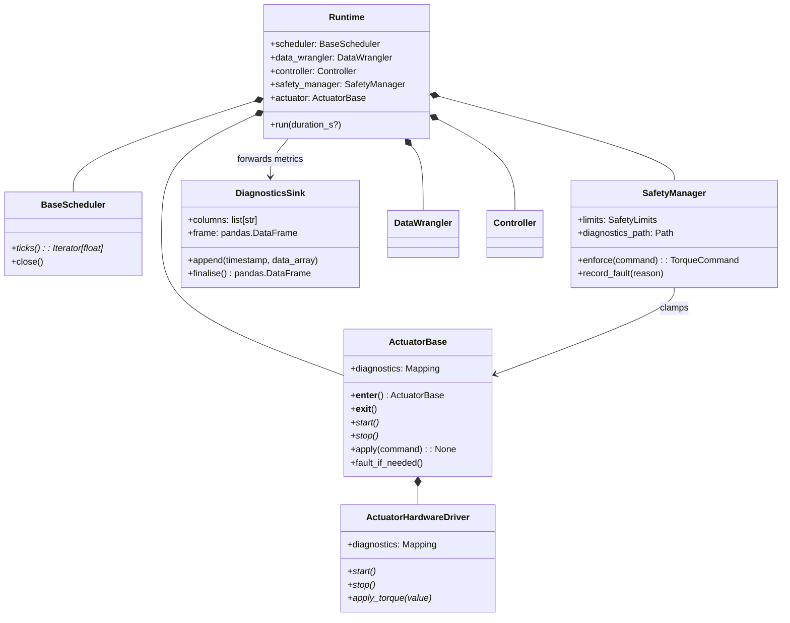

# Architecture Overview

This document specifies the controller runtime that will land alongside the new
profile-driven configuration pipeline. The goal is a simple yet flexible
architecture where sensors, actuators, and controllers can be swapped without
touching orchestration code.

- **Sensors** normalise hardware payloads into canonical signal names.
- **DataWrangler** plans how those signals are produced, owns feature buffers,
  and brokers reads between runtime and modalities.
- **Controllers** consume canonical features and emit torque commands while
  remaining agnostic to hardware specifics.
- **Safety + Actuators** enforce limits, surface diagnostics, and drive the
  physical interfaces.
- **Scheduler** governs cadence so the control loop can run deterministically on
  embedded Linux.

## Flow

### High-level loop



### End-to-end data flow



DataWrangler initialises once, so the runtime loop simply requests the next
packet each tick. Sensors emit canonical values; the wrangler places them into
the buffer following the controller-defined order. When a canonical feature is
declared as derived (no hardware provider), the responsible sensor computes it
from its measured channels; if that calculation fails, the tick faults
immediately rather than falling back to synthetic data. The runtime
orchestrator logs each feature/torque snapshot before applying the
safety-clamped command to the actuator.

## Profile configuration schema

Runtime instances are declared in YAML (see `scripts/mock_hardware_config.yaml`).
The top-level sections are `profile`, `input_signals`, `output_signals`,
`hardware`, and `controllers`. Key structures are:

### `input_signals`

An ordered list of mappings describing each canonical feature exposed to the
controller. Supported keys per entry:

| key        | type    | required | description |
|------------|---------|----------|-------------|
| `name`     | string  | yes      | Canonical signal identifier (e.g., `knee_flexion_angle_ipsi_rad`). |
| `hardware` | string  | no       | Sensor alias from `hardware.sensors`; omit for derived/software signals. |
| `required` | bool    | no       | Marks whether the runtime must receive this signal each tick. Optional signals may be absent, but no synthetic defaults are applied. |

Optional inputs exist to surface best-effort telemetry (e.g., a gait phase
estimator) without aborting the run. When an optional signal is missing for a
tick, diagnostics record the gap; the value is not silently substituted.

### `output_signals`

Ordered list mapping controller outputs to actuator aliases. Each entry
expects:

- `name` (string, required) – canonical torque identifier.
- `hardware` (string, required) – actuator alias from `hardware.actuators`.

### `controllers`

Controllers are keyed by name. Each entry declares:

- `implementation` – import path to the controller class.
- `joints` – ordered tuple of torque names emitted by the controller.
- `config` – controller-specific parameters (e.g., torque scale, limits).
- `torque_model` – mapping with `implementation` and `config` for the torque
  generator (e.g., bundle path, subject mass, assistance fraction).

These definitions align with the runtime validation logic in
`rpc_runtime.config.profile` and ensure declarative profiles stay consistent
across mock and hardware-backed deployments.

## Component Contracts

### DataWrangler interface

- `DataWrangler(required_inputs, signal_routes, sensors, *, diagnostics_sink=None)` —
  constructor wires in the ordered signal routes declared in the profile,
  verifies that every required signal has a backing sensor, and prepares
  provider→signal lookup tables. Signals that omit a provider are delegated to
  the owning sensor, which derives them from its measured channels. Validation
  failures raise `HardwareAvailabilityError`.
- `probe()` — performs lightweight readiness checks (e.g., ensure `/dev`
- `start()` — opens all configured sensors, performs warm-up/calibration, and
- `get_sensor_data()` — asks each sensor for its subscribed signals, stores the
  responses in the canonical buffer order, and returns a read-only view along
  with metadata (timestamp, stale flag, optional coverage map). Missing required
  measurements raise `SensorStaleDataError`; optional signals remain absent but
  are tracked via `FeatureMetadata.optional_presence` / `missing_optional` for
  diagnostics.
- `stop()` — stops all sensors and flushes modality diagnostics.

Plan construction happens in the constructor. After `start()` succeeds, the
wrangler is read-only; `get_sensor_data()` simply reuses the existing plan each
tick.

### Controller contract

- Controllers consume a fixed-order feature buffer whose indices are defined by
  the `input_signals` list. Outputs are produced in the order defined by the
  `output_signals` list. The controller may validate this order at start, but
  does not need to expose its own lists when the profile provides them.
- Controllers receive a `FeatureView` (mapping-like object) from the wrangler
  and must not mutate it.
- Controllers propagate `ControllerFault` exceptions when they cannot produce a
  torque command (e.g., model runtime error). The runtime catches these and
  follows the configured failure policy (zero torque, optional retry, or exit).

### Feature buffer ownership

- Allocated once, reused every tick; the runtime may retain a pointer for
  diagnostics, but only the wrangler writes into it.
- Buffer indices are stable across the session; derived signals occupy fixed
  slots and are populated by their owning sensor each tick.
- Each tick, the wrangler records presence/absence of optional (or derived)
  signals so the diagnostics sink can report coverage (e.g., missing GRF sensor).

### Diagnostics sink contract

- The runtime depends on an injectable `DiagnosticsSink` exposing
  `log_tick(...)` and `flush()` methods. Each `log_tick` call receives the
  timestamped feature snapshot, raw/safe torque commands, the `ControlInputs`
  bundle, and runtime metadata such as scheduler and safety metrics.
- The default implementation (`CSVDiagnosticsSink`) derives its header on the
  first tick and appends rows to `data.csv`. Scheduler-derived keys appear with
  a `scheduler_` prefix, while safety counters are emitted as
  `scheduler_safety_*` columns.
- Custom sinks should swallow their own errors and avoid blocking the control
  loop; heavy processing belongs in post-run tooling.

## Safety behaviour

The runtime loop does not maintain an explicit state machine. Execution is
linear:

1. Build the DataWrangler plan and probe hardware readiness.
2. Start sensors and actuator, then enter the scheduler loop.
3. Each tick: read sensor data, compute torques, clamp via safety, command the
   actuator.
4. If any step raises (sensor stale, controller fault, actuator error), catch
   the exception, emit zero torque, stop all hardware, finalise diagnostics, and
   exit.

Torque limits and clamp counters remain an internal concern of the
SafetyManager, but failures simply short-circuit execution; cleanup relies on
structured `try/except/finally` blocks rather than explicit state transitions.

## Timing and concurrency

- Wranglers and controllers run in the scheduler thread; sensor reads are
  blocking but expected to complete within `max_sensor_read_s` (configured per
  modality). Long-running sensors must provide non-blocking implementations or
  move heavy work into their drivers with caching.
- The scheduler governs cadence using monotonic time. It records:
  - `dt_target`, `dt_actual`, and the cumulative jitter metrics.
  - Controller compute duration (`compute_time_s`).
- If a tick overruns (`dt_actual > dt_target + jitter_budget`), the runtime logs
  a timing warning. After `max_overruns_before_fault` consecutive overruns, the
  loop raises a scheduler fault and triggers the standard shutdown path.
- Actuator commands are applied synchronously. If the actuator queue is
  asynchronous, the adapter must guarantee ordering and provide a completion
  callback for diagnostics.

## Diagnostics format

- **Primary log** (`data.csv`): the CSV written by `CSVDiagnosticsSink`. Each
  row captures `{timestamp, feature_snapshot, torque_command_raw,
  torque_command_safe, scheduler_metrics, safety_metrics}` plus any optional
  columns derived from runtime metadata (for example,
  `scheduler_optional_<signal>_present` and `scheduler_optional_missing_count`).
- **Diagnostics folder** (`diagnostics/`): optional supplemental artefacts such
  as readiness reports or actuator fault summaries written as JSONL/CSV. All
  files reside in this single directory with schema-versioned filenames (for
  example, `diagnostics/actuator_faults_v1.jsonl`).

Downstream tooling monitors `data.csv` and, when present, ingests additional
files from `diagnostics/`. No per-component subdirectories are required.

## Failure and retry policy

- **Sensor stale data**: Respect per-sensor `fault_strategy`.
  - `raise`: bubble `SensorStaleDataError`, trigger cleanup/exit.
  - `warn`: log, surface the gap in diagnostics, and continue with the signal
    omitted for that tick.
  - `fallback`: use sensor-specific substitution logic (when explicitly
    implemented) until fresh data returns; diagnostics record the substitution.
- **Derived signal failure**: treat as sensor stale; attribute to the originating
  modality in diagnostics.
- **Controller exceptions**: catch, emit zero torque, stop hardware, finalise
  diagnostics, and exit unless the controller declares a bounded retry policy.
- **Actuator errors**: catch, zero torque, stop hardware, surface diagnostics,
  and exit. Hardware adapters may classify recoverable vs fatal, but recovery
  happens outside the runtime loop.
- **Configuration mismatches**: detected during plan construction; abort before
  starting hardware.

## Sequence


### BaseSensor read sequence



### Startup handshake



**Validation guarantees**

- Every required controller signal must have at least one compatible provider.
- Optional signals may be satisfied by hardware or by sensor-side derivations.
  When a provider is unavailable for a tick, the gap is recorded in diagnostics
  without injecting placeholder values.
- Derived signals express their dependencies explicitly, so the plan fails early
  if prerequisites are unavailable.
- Probe failures bubble back up before the runtime loop starts, allowing the
  operator to fix hardware or choose a different profile before running.

### Control loop cadence



The runtime records per-tick timing, the full feature packet, and torque
commands both before and after safety enforcement. Actuators are allowed to
raise hardware faults after a command is applied; the runtime catches them and
either retries (if configured) or shuts down cleanly per the failure policy.

## UML

### Sensor and DataWrangler contracts



Sensor types (e.g., `BaseIMU`) maintain two views of their data:

- a **measured buffer** populated directly from hardware drivers (segment angles,
  raw force channels, etc.);
- a **canonical view** that exposes the controller’s requested signals. When the
  wrangler asks for a canonical value (such as
  `knee_flexion_angle_ipsi_rad`), the sensor computes it from the measured
  channels and returns only the canonical result. Derived expressions remain
  sensor-owned, so the wrangler never needs to understand how features are
  composed or which hardware devices participate.

If a sensor cannot supply a required canonical signal for a tick—because a raw
channel is missing or a derivation fails—it raises `SensorStaleDataError`. No
synthetic defaults are injected; missing optional channels are surfaced through
diagnostics so operators can decide whether to continue.


### Runtime, safety, and actuation



The UML diagrams serve as contracts for upcoming implementations. Any new
modalities or actuators must implement the abstract methods listed above and
report diagnostics in the documented format.

## Configuration Schema

### `hardware_config.yaml` layout

All runtime wiring lives in a single YAML document. To make operator edits
simple while keeping hardware details explicit, the top-level structure is
organised around ordered signals and a compact hardware table:

| Key | Required | Purpose |
|-----|----------|---------|
| `input_signals` | required | Ordered canonical inputs that define the feature buffer order. Each entry references a hardware alias and may include per-signal config overrides (e.g., required flags). |
| `output_signals` | required | Ordered canonical outputs that define the torque buffer order. Each entry targets an actuator alias. |
| `hardware` | required | Table mapping friendly hardware aliases to sensor/actuator classes and their config (e.g., ports). Signals reference these aliases to avoid verbosity. |
| `controllers` | required | Controller bundles with implementation, joints, config, and optional torque model. |
| `safety` | optional | Limit definitions (per-joint torque caps, fault strategies, watchdog timeouts). |
| `diagnostics` | optional | Sinks/paths for runtime artefacts (log roots, retention windows). |

Notes:
- No separate `drivers`, `sensor_types`, `measured_signals`, or `derived_signals`
  sections are needed. Any derivation is the responsibility of the SensorType
  implementation; configuration simply names the canonical signal and the
  hardware alias that provides it.
- The order of `input_signals` and `output_signals` is the canonical buffer
  order consumed/emitted by the controller.

### Example configuration

```yaml
profile:
  name: right_leg
  controller: pi_right_leg

# Ordered inputs/outputs define buffer indices for the controller
input_signals:
  - { name: hip_flexion_angle_ipsi_rad,        hardware: imu_serial }
  - { name: hip_flexion_velocity_ipsi_rad_s,   hardware: imu_serial }
  - { name: knee_flexion_angle_ipsi_rad,       hardware: imu_bt }
  - { name: knee_flexion_velocity_ipsi_rad_s,  hardware: imu_bt }
  - { name: vertical_grf_ipsi_N,               hardware: grf,          required: false }

output_signals:
  - { name: hip_flexion_moment_ipsi_Nm,  hardware: leg_actuator }
  - { name: knee_flexion_moment_ipsi_Nm, hardware: leg_actuator }

# Compact hardware table avoids repeating class strings and ports per signal
hardware:
  sensors:
    imu_serial:
      class: rpc_runtime.sensors.imu.microstrain_3dm_gx5.Microstrain3DMGX5IMU
      config:
        port_map:
          thigh: /dev/ttyIMU_thigh
          shank: /dev/ttyIMU_shank
        calibration_samples: 500
        calibration_interval_s: 0.002
    imu_bt:
      class: rpc_runtime.sensors.imu.bluetooth.BluetoothIMU  # example Bluetooth adapter
      config:
        address_map:
          thigh: E8:EA:71:E8:37:D1
          shank: E8:EA:71:E8:37:D2
        connection_timeout_s: 2.0
    grf:
      class: rpc_runtime.sensors.grf.fsr.BluetoothFSR
      config:
        address: E8:EA:71:E8:37:D1

  actuators:
    leg_actuator:
      class: rpc_runtime.actuators.osl_actuator.OSLActuator
      port: /dev/ttyACM0
      config: {}

controllers:
  pi_right_leg:
    implementation: rpc_runtime.controllers.pi_controller.PIController
    joints: ["hip_flexion_moment_ipsi_Nm", "knee_flexion_moment_ipsi_Nm"]
    config:
      dt: 0.002
      torque_scale: 1.0
      torque_limit_nm: 60.0
    torque_model:
      implementation: rpc_runtime.controllers.torque_models.torchscript.TorchScriptTorqueModel
      config:
        bundle_path: /opt/models/right_leg.ts

safety:
  limits:
    hip_flexion_moment_ipsi_Nm:  { max_torque_nm: 70.0, clamp_strategy: saturate }
    knee_flexion_moment_ipsi_Nm: { max_torque_nm: 80.0, clamp_strategy: saturate }
  watchdog:
    max_tick_hz_delta: 0.0005

diagnostics:
  sinks:
    - type: filesystem
      path: /var/log/rpc_runtime
      history: 14d
```

To switch from the serial IMU to the Bluetooth variant, change the
`hardware` alias in each IMU-related `input_signals` entry from `imu_serial` to
`imu_bt`. The canonical signal names and ordering stay unchanged.

### Canonical signals and derivation

- Canonical names are registered centrally so controllers and hardware share the
  same vocabulary (`hip_flexion_angle_ipsi_rad`, `vertical_grf_ipsi_N`,
  `knee_flexion_moment_ipsi_Nm`, etc.).
- Derivation is handled inside sensor implementations (e.g., an IMU may
  compute `knee_flexion_angle_ipsi_rad` from segment angles held in its measured
  buffer). Configuration only maps canonical signals to hardware aliases or
  marks them as derived.
- Optional inputs are marked on `input_signals` entries (e.g., `required: false`).
  Absence is handled by runtime policy rather than config-level defaults.

Note: Canonical signal names and ordering are defined in the separate LocoHub
library and imported by this runtime. Adopt LocoHub conventions rather than
duplicating definitions here. See LocoHub/src/locohub/README.md (e.g.,
`locohub.feature_constants`) for the authoritative registry and feature
ordering.

### Calibration, diagnostics, and artefacts

- Calibration routines run immediately after sensors start during the
  calibration step. Sensors that expose `zero()` opt into the hook; retry counts
  and failure handling are governed by `calibration.*` defaults.
- Diagnostics write into a single `diagnostics/` directory under the configured
  log root. Files are JSONL/CSV snapshots (readiness reports, actuator summaries)
  with schema-versioned filenames so tooling can evolve alongside the runtime.
- Each runtime session emits `data.csv` (the diagnostics CSV persisted to disk)
  containing time-aligned feature packets, commanded torques, scheduler jitter,
  safety counters, and shutdown events.

### Extensibility checklist

To add a new modality or actuator:

1. Implement the abstract methods shown in the UML diagrams and honour the
   component contracts described above.
2. Register any new canonical signals with documentation and dependencies.
3. Register the hardware alias and class under `hardware.sensors` or
   `hardware.actuators` and map signals under `input_signals`/`output_signals`.
4. If the modality synthesises signals, implement derivation inside the sensor
   type; no config changes beyond signal mapping are required.
5. Update `input_signals`/`output_signals` ordering or joints as needed and
   update `FeaturePlan` validation tests.
6. Provide calibration hooks so the calibration step can execute cleanly.
7. Emit diagnostics in the documented JSONL format and bump schema versions when
   fields change.
8. Update the failure policy documentation or defaults if the new component
   introduces non-standard retry logic.

With those pieces in place, the RuntimeLoop can swap components by loading a
different profile without requiring code changes.
