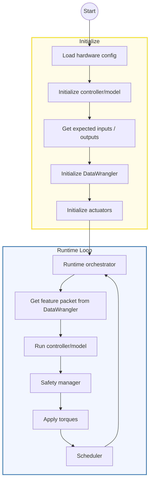
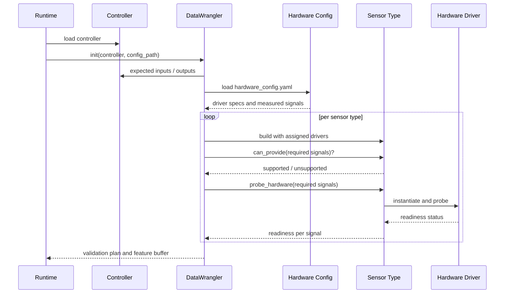
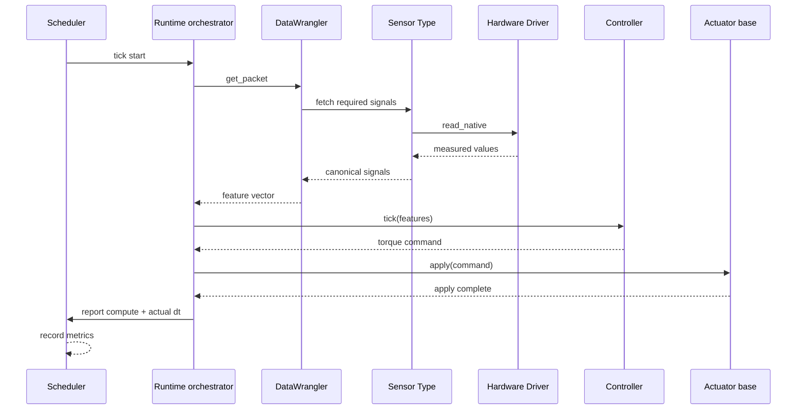
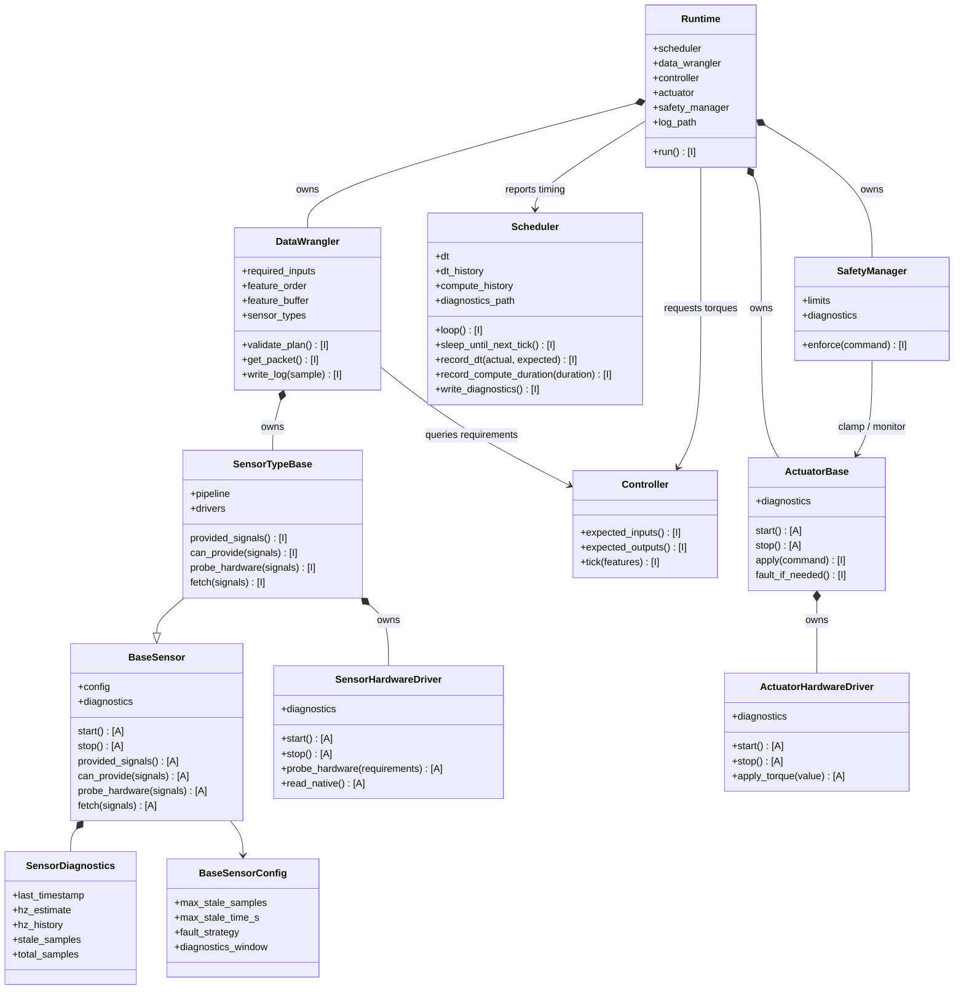
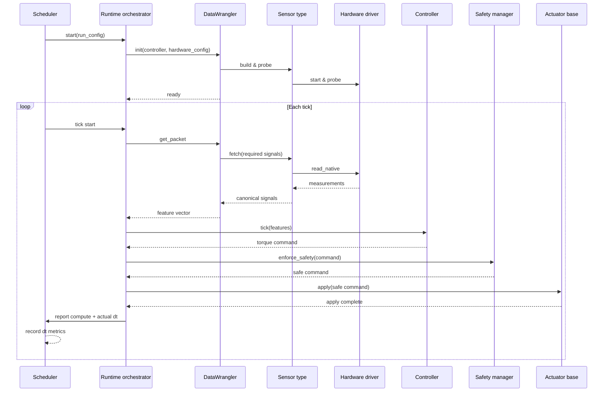
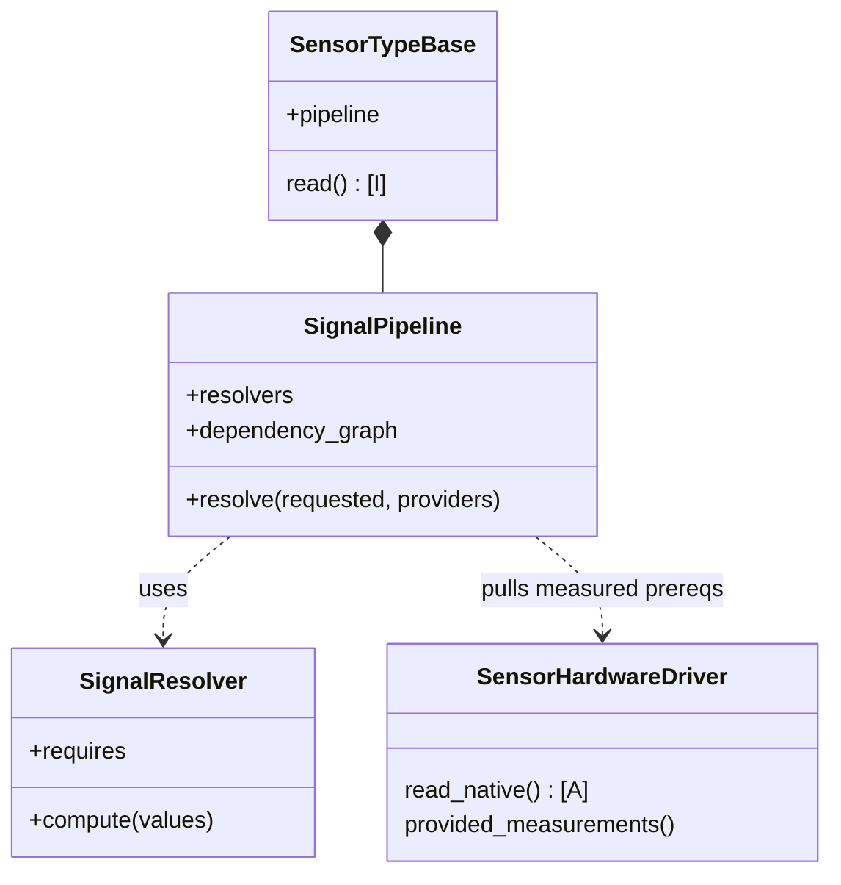

# Architecture Overview

The runtime splits responsibilities into four layers:

1. **Sensors** — `rpc_runtime.sensors` exposes hardware‑agnostic modality bases (e.g., IMU/GRF) and hardware drivers. Adapters translate vendor payloads into standardized samples; modality bases aggregate multiple drivers and compute canonical signals.
2. **DataWrangler & Controllers** — The DataWrangler compiles controller-required signals from the sensors and feeds them to controllers in `rpc_runtime.controllers`. Controllers (e.g., the PI controller with ONNX/TorchScript torque models) declare required input/output signals and emit torque commands.
3. **Actuators** — `rpc_runtime.actuators` provides safe torque application and fault reporting. Adapters validate joint membership and enforce optional torque limits.
4. **Timing management** — A scheduler component (e.g., `rpc_runtime.pipelines.scheduler` or platform-specific timer) governs loop cadence, ensuring deterministic timing when needed.

Configuration lives in a single `hardware_config.yaml`. Controllers declare the
canonical signals they consume and produce; the hardware config maps measured
signals to concrete drivers and establishes defaults. Derived signals are
computed in code by the modality pipeline (no config fields required).

Example `hardware_config.yaml`:

```yaml
defaults:
  dtype: float32
  fault_strategy: raise
  include_mask: false

drivers:
  thigh_imu:
    class: rpc_runtime.sensors.imu.microstrain_3dm_gx5.Microstrain3DMGX5IMU
    config:
      port_map:
        thigh: /dev/ttyIMU_thigh
      max_stale_samples: 3
  shank_imu:
    class: rpc_runtime.sensors.imu.mock.MockIMU
    config:
      loop: true
  fsr:
    class: rpc_runtime.sensors.grf.fsr.BluetoothFSR
    config:
      address: E8:EA:71:E8:37:D1

measured_signals:
  thigh_angle: thigh_imu
  thigh_rate: thigh_imu
  shank_angle: shank_imu
  shank_rate: shank_imu
  grf_total: fsr
```

Startup:
- Controller exposes `expected_inputs` and `expected_outputs` (ordered).
- Load `hardware_config.yaml`; instantiate drivers; build one SensorType per modality/scope.
- DataWrangler validates capability and hardware, compiles a plan, and allocates
  a reusable feature buffer (dtype from defaults).
- Runtime loop calls `wrangler.get_packet` each tick and forwards the feature
  vector to the controller; torques route to actuators via the runtime loop.

## High‑level flow



DataWrangler performs configuration validation and planning once at
initialisation, so the runtime loop only asks it for feature packets each tick.

### DataWrangler initialisation sequence



### DataWrangler runtime sequence



### High-level class relationships




The scheduler keeps its own history of expected versus actual loop periods and controller compute durations so timing jitter can be analysed without relying on sensor diagnostics. Sensors continue to compute their own timing statistics via SensorDiagnostics so data validity remains decoupled from scheduler timing.
Each run writes artefacts into a timestamped folder containing:

- `run.log` — merged signal + torque stream annotated with timestamps.
- `diagnostics/sensors/` — per-sensor diagnostic logs (staleness, rates).
- `diagnostics/actuators/` — actuator diagnostics (faults, clamp counts).
- `diagnostics/scheduler/` — loop timing metrics (dt history, compute times).
- `diagnostics/safety/` — safety limit events and clamp statistics.

The controller remains a pure mapping from inputs to torque commands; limit enforcement and actuator interfacing live in the runtime via the SafetyManager.
ActuatorBase forwards safe torques to the concrete ActuatorHardwareDriver, which owns the platform-specific I/O and diagnostics.


## Control loop sequence



<!-- Legacy interface overview removed in favor of DataWrangler-centric diagrams. -->

## Measured vs. derived signals

Some canonical signals are measured directly by drivers (e.g., segment angles);
others are derived by the sensor type from prerequisites (e.g., joint angle
derived as the difference of two segment angles). The sensor type uses a small
SignalPipeline to compute derived values across one or more drivers.


