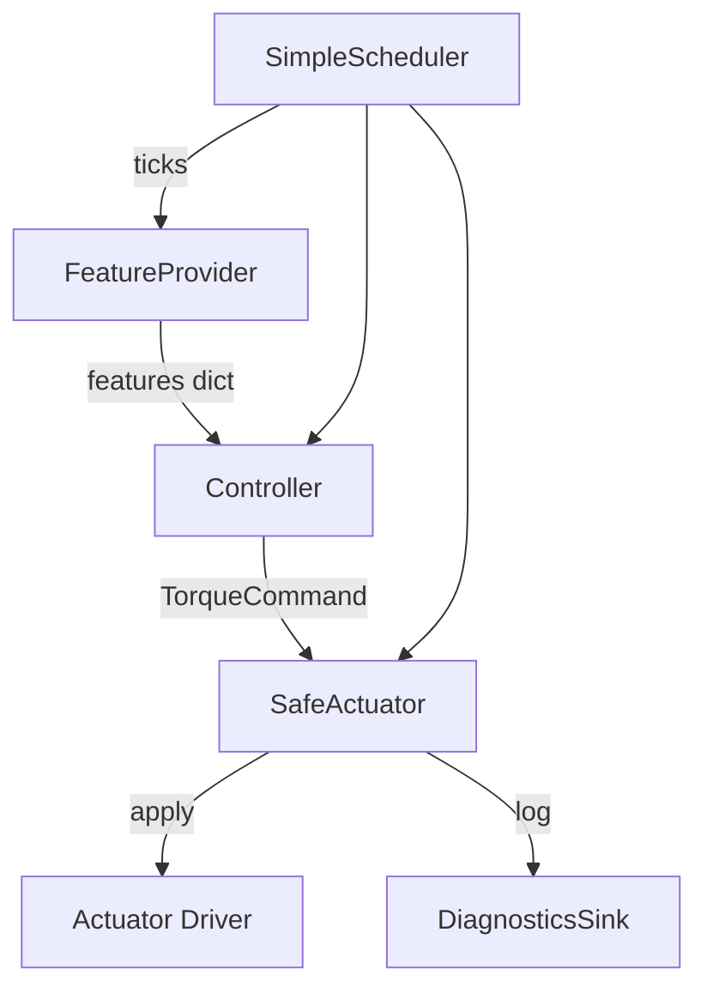

# Minimal Controller Runtime Architecture

This variant trims the runtime to the smallest set of concepts that still run a robust loop on embedded Linux. It favors fewer abstractions, name‑keyed features (no ordering), and a single, non‑blocking diagnostics stream.

## Goals

- Minimal moving parts and code paths
- Single‑threaded, predictable loop cadence
- Name‑keyed features; no index/order coupling
- Safety enforced at the actuator boundary
- Diagnostics that never block the loop

## Components

- FeatureProvider
  - `start(config)` → initialise sensors
  - `read()` → `dict[str, float]` of features (derived inline)
  - `close()`
- Controller
  - `reset()` → clear internal state
  - `compute_torque(features: dict[str, float]) → TorqueCommand`
- SafeActuator (wrapper around hardware driver)
  - `apply(command)`; clamps to per‑joint limits before forwarding
  - `zero()`; `fault_if_needed()`; policy config for clamp behavior
- SimpleScheduler
  - `ticks()` generator at fixed frequency using monotonic time
- DiagnosticsSink (single stream)
  - `log(entry: dict)`; `flush()`; appends newline‑delimited JSONL

## Data Flow



No preallocated feature buffer and no plan/index alignment. Controllers read by name from a plain dict.

## Minimal Loop (pseudocode)

```python
with SimpleScheduler(f_hz) as sched,\
     FeatureProvider(config) as fp,\
     SafeActuator(driver, limits) as act,\
     Controller(ctrl_cfg, model) as ctrl:
    ctrl.reset()
    for i, tick in enumerate(sched.ticks()):
        t0 = now()
        features = fp.read()                     # dict[str, float]
        raw = ctrl.compute_torque(features)      # TorqueCommand
        safe = act.clamp(raw)                    # optional pre‑apply clamp
        act.apply(safe)
        diagnostics.log({
            "ts": raw.timestamp,
            "features": features,
            "torque_raw": raw.torques_nm,
            "torque_safe": safe.torques_nm,
            "dt_actual": tick.dt_actual,
            "compute_time_s": now() - t0,
            "events": []
        })
```

## Contracts (trimmed)

- FeatureProvider
  - Returns all required feature keys; when data is stale, fills defaults and sets `features["_stale"] = True` (or emits an event).
- Controller
  - Pure function of the current features plus small internal state (e.g., integrators). Throws → Faulted.
- SafeActuator
  - Enforces per‑joint limits and zero‑on‑fault policy; hardware faults raise immediately.
- DiagnosticsSink
  - Never raises; IO buffered; one JSONL file per run (`run.log`).

## States (3 only)

1. Init — start sensors/actuator; optional calibration inline with bounded retries; zero actuator before entering Running.
2. Running — normal loop; clamp counters tracked by SafeActuator.
3. Faulted — on controller exception, hardware error, or operator stop. Immediately zero actuator and flush diagnostics.

“Degraded” is represented by clamp/default counters and events, not a separate mode.

## Failure Policy (succinct)

- Sensor stale → log and default; optional escalate flag to Faulted.
- Controller exception → Faulted (zero + flush).
- Actuator error → Faulted; driver may mark recoverable vs fatal, but Faulted stops the loop.

## Diagnostics Schema (single stream)

`run.log` (JSONL), one object per tick:

```json
{
  "schema": 1,
  "ts": 1234567.89,
  "features": {"hip_angle": 0.12, "grf_0": 110.0},
  "torque_raw": {"hip": 2.3},
  "torque_safe": {"hip": 2.1},
  "dt_actual": 0.01,
  "compute_time_s": 0.0007,
  "events": ["stale_imu", "clamp_hip"]
}
```

Sensors and actuators may also append periodic summaries into the same file with `"category": "sensor" | "actuator"` to avoid multiple sinks.

## Extending

- New sensor: implement `FeatureProvider.read()` to populate agreed keys.
- New derived feature: pure function inside `read()`; no registry required.
- New actuator: implement driver; wrap with `SafeActuator` limits.
- New control law: implement `Controller.compute_torque()`; consume named features only.

That’s it—four objects, one loop, one log.

