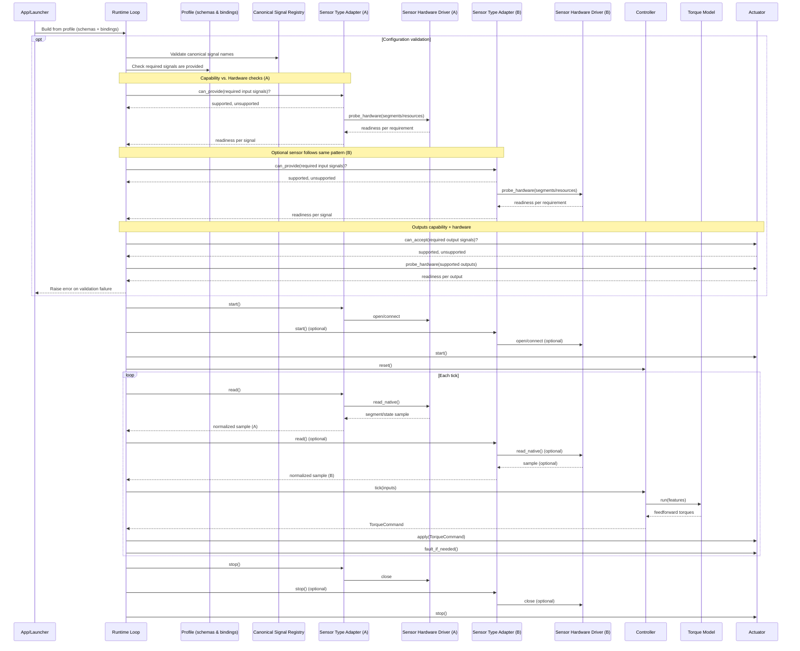
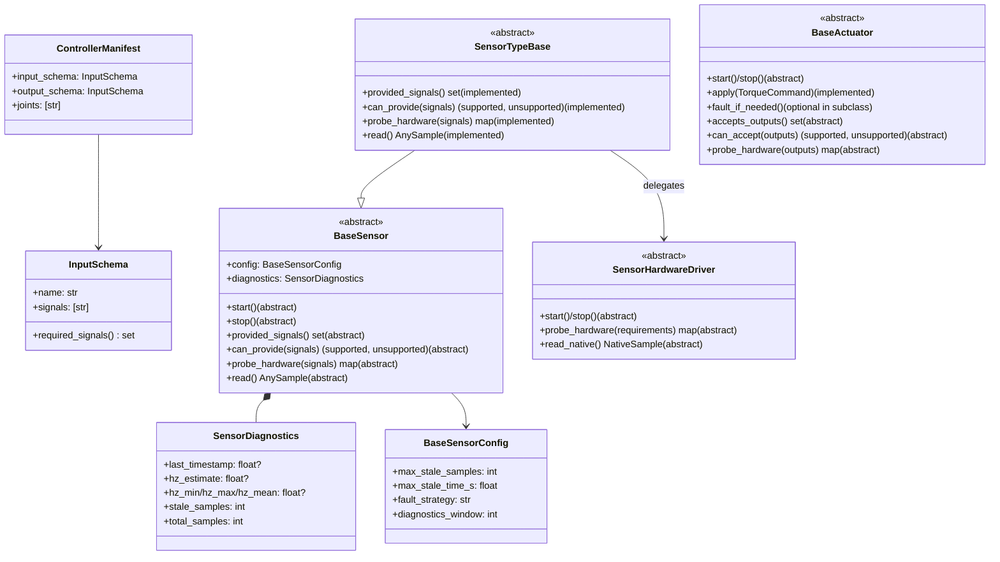
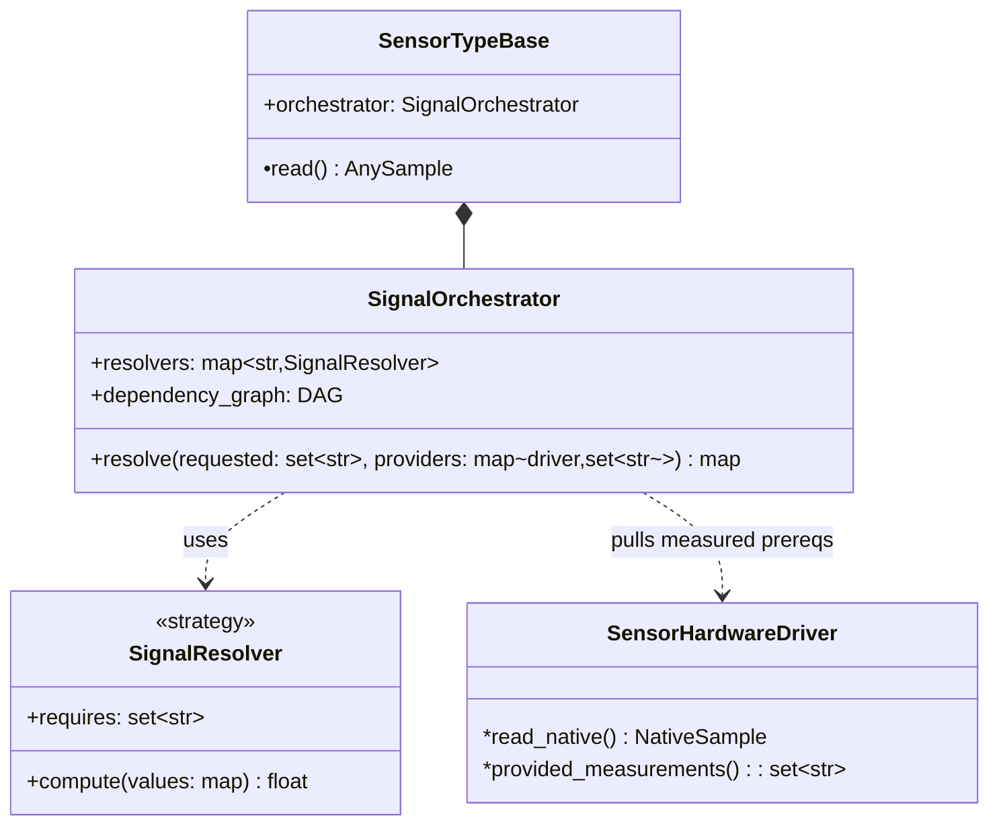
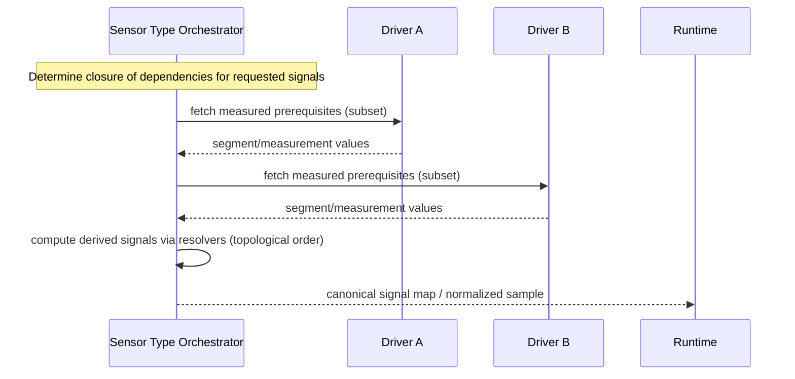

# Configuration Profiles

Profiles are lightweight YAML files that declare which sensors, actuators, and
controller bundle the runtime should start. Keep only three questions in mind:

- **Hardware bindings:** which adapter classes should run, and with what port or
  address configuration?
- **Controller schema:** which named channels feed the controller, and which
  hardware binding satisfies each channel?
- **Outputs:** which actuator receives each controller output?

## Minimal profile

```yaml
profile:
  name: right_leg_mock
  controller: pi_mock
  actuator: mock_leg
  sensors:
    - name: imu
      binding: imu_mock
    - name: grf
      binding: grf_mock

schemas:
  pi_schema:
    channels:
      - knee_angle
      - knee_velocity
      - ankle_angle
      - ankle_velocity
      - { signal: grf_total, required: false }

controllers:
  pi_mock:
    implementation: rpc_runtime.controllers.pi_controller.PIController
    input_schema: pi_schema
    joints: ["knee", "ankle"]
    config: {...}
    torque_model: {...}

sensors:
  imu_mock:
    driver: rpc_runtime.sensors.imu.mock.MockIMU
    provides:
      - knee_angle
      - knee_velocity
    config: {}
  grf_mock:
    driver: rpc_runtime.sensors.grf.mock.MockVerticalGRF
    provides:
      - grf_total
    config: {}
```

Optional channels can be marked with `required: false`; the controller will
fall back to the declared `default` value when the hardware is absent.

## Canonical signals

All controllers and hardware bindings reference a shared registry of canonical
signal names. The current catalogue includes:

| Signal | Description | Typical units |
|--------|-------------|---------------|
| `knee_angle` | Sagittal-plane knee angle from the IMU | radians |
| `knee_velocity` | Sagittal-plane knee angular velocity | rad/s |
| `ankle_angle` | Sagittal-plane ankle angle from the IMU | radians |
| `ankle_velocity` | Sagittal-plane ankle angular velocity | rad/s |
| `grf_total` | Total vertical GRF measurement | newtons |
| `knee_torque` | Controller torque command for the knee | newton-metres |
| `ankle_torque` | Controller torque command for the ankle | newton-metres |

When you introduce a new signal, add it to `CANONICAL_SIGNAL_REGISTRY` so it can
inherit defaults and documentation across profiles.

## Hardware naming

Use descriptive, lowercase identifiers that encode the device and placement, for
example:

- `microstrain_left_shank_imu` (provides the knee/ankle signals)
- `bluetooth_fsr_right_foot` (provides `grf_total`)
- `osl_leg_right` (consumes `knee_torque`/`ankle_torque`)

## Built-in adapters

- IMU: `rpc_runtime.sensors.imu.mock.MockIMU`, `...microstrain_3dm_gx5.Microstrain3DMGX5IMU`, `...simulated.SimulatedIMU`
- GRF: `rpc_runtime.sensors.grf.mock.MockVerticalGRF`, `...grf.fsr.BluetoothFSR`
- Actuator: `rpc_runtime.actuators.mock.MockActuator`, `rpc_runtime.actuators.osl_actuator.OSLActuator`

Swap hardware by pointing a binding at the desired driver string and updating
its `provides` list. The controller schema stays unchanged, keeping the profile
easy to reason about.

## Control loop sequence



<!-- Profile wiring sequence removed in favor of configuration validation block above. -->

## Interfaces overview (proposed)



### Notation legend
- `*` abstract method (must be implemented by subclass)
- `•` implemented method (provided by the class shown)
- `°` optional method (subclass may override/implement)

## Measured vs. derived signals

Some canonical signals are measured directly by drivers (e.g., segment angles);
others are derived by the sensor type from prerequisites (e.g., joint angle
derived as the difference of two segment angles). The sensor type acts as an
orchestrator across multiple hardware drivers.



### Per‑tick resolution flow



During configuration validation, the orchestrator verifies capability (all
dependencies resolvable given driver-provided measurements) and hardware
availability (drivers can actually read the needed measurements).

Adapters should raise during initialisation if they cannot provide a requested
signal, preventing the runtime from entering the control loop with missing
channels.
